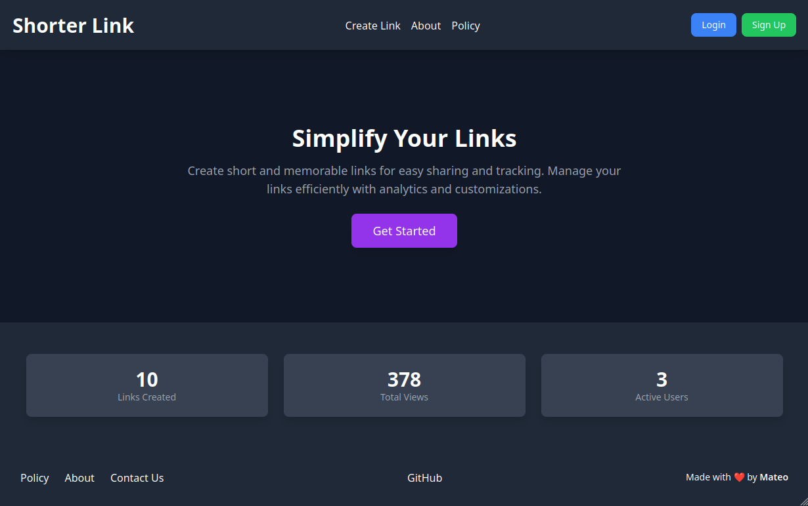
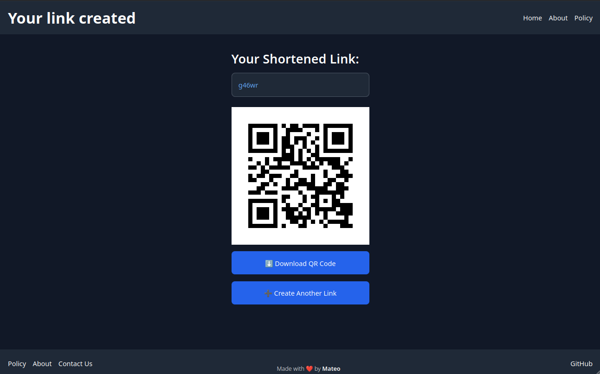
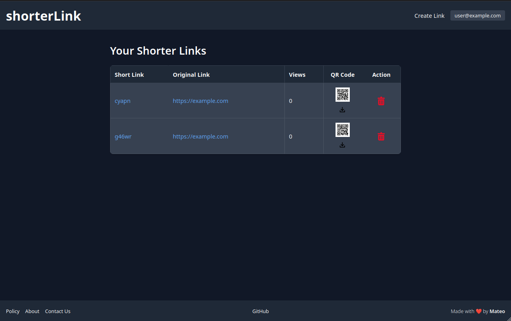

# ShorterLink Project



## 📚 Introduction
ShorterLink is a URL shortening web application built with Flask. It allows users to create short, easily shareable URLs from long links, track their views, and manage their links through a user-friendly interface.

## 🚀 Features
- **Responsive Design**: Fully responsive for both desktop and mobile devices.
- **User Authentication**: Sign up and log in functionality with cookie-based authentication.
- **Link Management**:
  - Create short links from long URLs.
  - Customizable short links.
  - Delete existing links.
- **Analytics**:
  - Track the number of views for each link.
  - Display total views, links created, and user count on the homepage.
- **Public and Private Views**:
  - Public homepage for non-logged-in users.
  - Personalized dashboard for logged-in users.
- **Security**:
  - Basic authentication with cookie-based session management.
  - Validation for link ownership before deletion.
-  **Caching**:
  - Redis caching to optimize link redirection and view count operations.

## 🏃 How to Run
1. Clone the repository:
```bash
$ git clone git@github.com:mateo-rfz/shorterLink.git
$ cd ShorterLink
```
2. Set up a virtual environment and install dependencies:
```bash
$ python3 -m venv venv
$ source venv/bin/activate
$ pip install -r requirements.txt
```
3. Run the application:
```bash
$ python app.py
```
4. Open your browser and go to:
```
http://<local-ip>:80
```

## 🐳 Docker Setup
You can also run ShorterLink using Docker:

1. Build the Docker image:
```bash
docker build -t shorterlink .
```
2. Run the Docker container:
```bash
docker run -p 80:80 -d shorterlink
```
3. Access the app in your browser:
```
http://localhost:80
```

## 📧 Contact
For inquiries or support, please reach out via the **Contact Us** page on the site.

## ⚖️ License
This project is licensed under the GPL-3.0 License.

---

Happy shortening! ✂️




